<div align="center">

<br/><br/>

# ASHISH GUPTA

**Building practical products, exploring ambitious ideas, and learning in public.**

<br/>

[](https://github.com/hello-ashish)
[](mailto:agupta118258@gmail.com)
[](https://explore-us.vercel.app)
[](https://www.linkedin.com/in/helloashish8258)
[](https://x.com/kumar_gupt_03)

<br/><br/>

<!-- Custom Developer Dashboard Generated via GitHub Actions -->
<picture>
  <source media="(prefers-color-scheme: dark)" srcset="assets/developer-dashboard.svg">
  <source media="(prefers-color-scheme: light)" srcset="assets/developer-dashboard.svg">
  
</picture>

</div>

<br/><br/>

## 🛠️ Building things that should exist.

I am a developer, the founder of **AroundUs**, and a relentless product builder. My public work ranges from browser-based productivity tools and real-time web experiments to AI-powered applications, security-focused platforms, and systems projects.

I enjoy turning a rough idea into something people can actually use over a single weekend. For me, engineering is about defining the problem, shaping the experience, and owning the product all the way through to deployment.

---

## 🏗️ Currently Building

<table border="0">
<tr>
<td width="100%">

### AroundUs
*A product I am building from the ground up.*

**AroundUs** is my core focus. I am currently architecting the platform, refining the core feature set, and building out the foundational infrastructure required to scale it.

`Web Platform` `Startup` `Founder`
</td>
</tr>
</table>

---

## 💼 Selected Work

<table border="0">
<tr>
<td width="50%" valign="top">

**[AudioCast](https://github.com/hello-ashish/AudioCast)**  
Low-latency web application that turns a phone into a wireless speaker for a laptop. Uses browser audio sharing, QR-code pairing, and WebRTC to stream synchronized sound to multiple phones.  
`TypeScript` `WebRTC` `React`

</td>
<td width="50%" valign="top">

**[ZeroLeak-v2](https://github.com/hello-ashish/ZeroLeak-v2)**  
A zero-trust secure platform designed from the ground up. Focuses on secure data handling and privacy-first architectural patterns.  
`Security` `JavaScript` `Zero-Trust Architecture`

</td>
</tr>
<tr>
<td width="50%" valign="top">

**[mdtopdf](https://github.com/hello-ashish/mdtopdf)**  
Browser-based Markdown-to-PDF converter designed to keep files strictly local. Includes live preview, PDF settings, and multi-file handling.  
`TypeScript` `React` `Vite` `Client-side Processing`

</td>
<td width="50%" valign="top">

**[BookViera.in](https://github.com/hello-ashish/BookViera.in)**  
An AI-powered application that generates personalized books. Integrates natural language processing and dynamic content generation.  
`Python` `AI / ML` `Generative Systems`

</td>
</tr>
<tr>
<td width="50%" valign="top">

**[CipherCraft](https://github.com/hello-ashish/CipherCraft)**  
A versatile encryption and decryption suite supporting multiple modern cipher technologies.  
`Security` `TypeScript` `Cryptography`

</td>
<td width="50%" valign="top">

**[MyDukaan](https://github.com/hello-ashish/MyDukaan)**  
Mobile inventory management application focusing on small businesses.  
`Mobile` `Kotlin` `Android`

</td>
</tr>
</table>

---

## 🌐 Ecosystem Distribution

Based on my repository history, here is how my public projects are distributed across technical domains:

```text
Web & Full Stack     ████████████████████████ (7)
Systems & Backend    ████████████████████████ (7)
Mobile               ██████████               (3)
Security             ██████████               (3)
AI / ML              ███████                  (2)
Real-time / WebRTC   ███                      (1)
```

---

## 🧬 Engineering DNA

**LANGUAGES**  
`TypeScript` `JavaScript` `Python` `Java` `Kotlin` `C++`

**FRONTEND & CLIENT**  
`React` `HTML5` `CSS3` `Vite`

**REAL-TIME & SYSTEMS**  
`WebRTC` `WebSockets` `Linux`

**SECURITY & AI**  
`Zero-Trust Patterns` `Encryption/Decryption` `LLM Integrations`

---

## 📊 Analytics & Activity

<div align="center">
  <table border="0">
    <tr>
      <td width="50%">
        
      </td>
      <td width="50%">
        
      </td>
    </tr>
  </table>

  <!-- Productive Time Graph -->
  
</div>

---

## 🔭 Currently Exploring

- ⚡ **Advanced WebRTC:** Exploring deeper peer-to-peer data channels, mesh networks, and optimizing low-latency transport.
- 🤖 **AI Integrations:** Experimenting with local models, retrieval-augmented generation (RAG), and agentic workflows.
- 🔐 **Secure Web Platforms:** Refining zero-trust architectures and exploring modern cryptography for the web.

---

## 🚀 What's Next?

I am fully focused on launching the next iteration of **AroundUs** while continuing to open-source my experiments in real-time communication and AI. I build in public because I believe the best way to learn is to share the journey.

<br/>

<div align="center">

*Built with curiosity. Shipped with intent.*

</div>